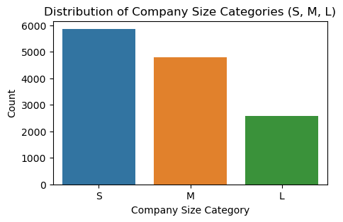
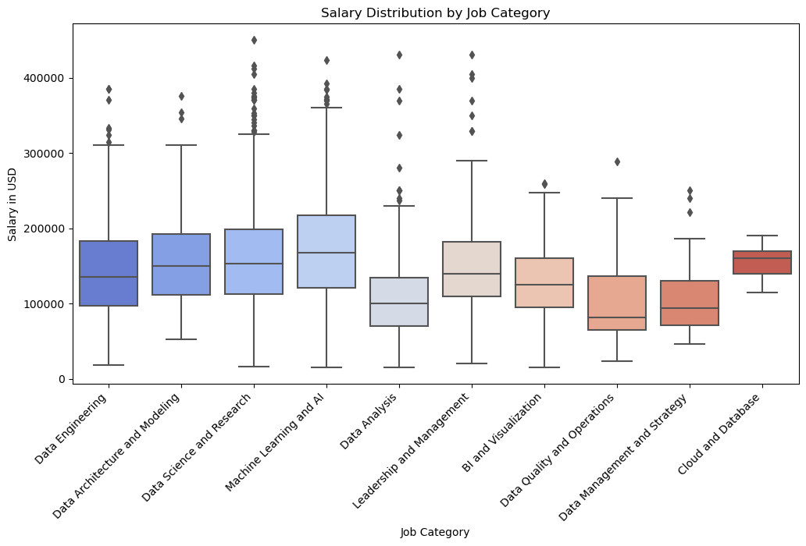

# Project of Data Visualization (COM-480)

| Student's name | SCIPER |
| -------------- | ------ |
|Zaineb Tafasca | 326940|
|Imane Zaaraoui |314994 |
|Tamara Antoun |324875 |

[Milestone 1](#milestone-1) • [Milestone 2](#milestone-2) • [Milestone 3](#milestone-3)

## Milestone 1 (21st March, 5pm)

**10% of the final grade**

This is a preliminary milestone to let you set up goals for your final project and assess the feasibility of your ideas.
Please, fill the following sections about your project.

*(max. 2000 characters per section)*

### Dataset

For this project, we selected two datasets:

1. **[Data Science Job Data Set](https://www.kaggle.com/datasets/sachinkumar62/datascience-job-data)**  
   This dataset includes information on job candidates applying for data science roles, covering demographic details, education background, work experience, and training hours.  
   - **Target variable**: Whether a candidate is actively looking for a new job (1) or not (0)  
   - **Size**: 19,158 samples  
   - **Notes**: Contains outliers, missing values, and potentially irrelevant columns requiring data cleaning

2. **[Cleaned – Jobs and Salaries in Data Science](https://www.kaggle.com/datasets/malingarajapaksha/cleaned)**  
   This dataset contains 5,341 entries and focuses on salaries within the data science field, which is missing in the first dataset.  
   - **Size**: 5,341 samples  
   - **Notes**: Already cleaned and structured, suitable for analyzing salary trends and job fields in data science

### Problematic

> Frame the general topic of your visualization and the main axis that you want to develop.
> - What am I trying to show with my visualization?
> - Think of an overview for the project, your motivation, and the target audience.

This project focuses on understanding the factors that drive job transitions in the data science field.
The visualization will explore how education, experience, company characteristics, and demographics
influence an individual’s decision to seek a new job. By identifying trends in job-seeking behavior, we
can provide valuable insights into career mobility in the data science industry.

### Key Questions from Dataset 1 (Job Seeking Behavior)

- **Education & Training**: Do higher degrees or more training hours lead to more job changes?
- **Work Experience**: Are experienced professionals more likely to stay or seek new roles?
- **Company Characteristics**: Does company size or type impact retention?
- **Demographic Insights**: Are there gender or location-based differences in job-seeking behavior?
- **City Development Index**: Do professionals in developed cities have better job stability?

  
The second dataset can address several key problems related to salary analysis and job market trends
in the data science field. Here are some potential problems that can be explored:

### Key Questions from Dataset 2 (Salary & Market Trends)

- **Salary Disparities Across Job Titles and Categories**: How do salaries differ across various job categories (e.g., Data Analysis vs. Machine Learning)? This analysis can help identify high-demand, high-paying fields.
- **Impact of Experience on Salaries**: How does professional experience (Entry-level, Mid-level, Senior, Executive) correlate with salary growth?
- **Geographical Salary Differences**: How do geographical factors, such as employee residence and company location, impact salary disparities?
- **Variation of Salaries from 2020–2023**: How have salaries changed from 2020 to 2023? What trends can we observe in salary growth or decline, and how might the COVID-19 crisis have impacted these changes?

### Exploratory Data Analysis

> Pre-processing of the data set you chose
> - Show some basic statistics and get insights about the data

We conducted a preliminary analysis to uncover patterns in roles, company sizes, salaries, and educational backgrounds. The goal is to understand the structure of the data and extract useful insights for further modeling or reporting.

### Key Visualizations

#### 1. Company Size Category Distribution
Shows how data science roles are spread across small (S), medium (M), and large (L) companies.

---

#### 2. Salary Distribution (Boxplot)
Visualizes salary spread and outliers.

---

#### 3. Major Discipline Breakdown
Highlights the most common academic disciplines (e.g., STEM, Business) among professionals.

---

#### Further Analysis
More visualizations and insights are available in the accompanying notebooks:
- [data_inspection_d2.ipynb](data_inspection_d2.ipynb)
- [data_science_analysis_d1.ipynb](data_science_analysis_d1.ipynb)

### Related work

> - What others have already done with the data?
The Data Science Job Dataset has been explored in various ways, mainly through machine learning
models for job-seeking prediction and EDA (Exploratory Data Analysis) on candidate demographics
and company types. Many Kaggle notebooks and blog posts have focused on predicting whether a
candidate is likely to look for a new job using classification models like logistic regression, random
forests, and deep learning.

For the ”Cleaned - Jobs and Salaries in Data Science”, a previous analysis explores trends in data
science job postings over time. It visualizes how the number of jobs has changed monthly, highlights
the most common job titles and how their popularity has shifted, and examines trends in work modes
(remote, onsite, hybrid).

> - Why is your approach original?

Unlike prior works that primarily focus on machine learning predictions, our approach prioritizes inter-
active visual storytelling, making the insights more accessible to students, recent graduates, recruiters,
and industry professionals. Instead of simply building a model to predict job-seeking behavior, we
will visualize career mobility trends, relationships between skills and employability, and the impact
of company characteristics on retention. Our approach is also highly relevant to us as data science
students, providing guidance for those entering the workforce.

Our analysis of the second dataset offers a more original perspective by not only tracking how data
science roles have evolved over time but also exploring external factors driving these trends. Unlike
the referenced analysis which focuses primarily on descriptive trends, our approach aim to examine the
impact of events such as the COVID-19 pandemic, the rise of remote work. Furthermore, our approach
aims to focus on salary disparities over time across job roles, locations, and experience levels.

> - What source of inspiration do you take? Visualizations that you found on other websites or magazines (might be unrelated to your data).

Our inspiration comes from multiple sources, particularly our own experiences as data science students
entering the job market. Like many students and recent graduates, we actively follow job market trends
and salaries through platforms such as LinkedIn, Glassdoor job reports. These platforms have helped
us understand how data professionals navigate their careers, and they inspired us to explore what
factors influence job mobility in data science with this dataset.

> - In case you are using a dataset that you have already explored in another context (ML or ADA course, semester project...), you are required to share the report of that work to outline the differences with the submission for this class.

## Milestone 2 (18th April, 5pm)

**10% of the final grade**

## Milestone 3 (30th May, 5pm)

**80% of the final grade**

## Late policy

- < 24h: 80% of the grade for the milestone
- < 48h: 70% of the grade for the milestone

